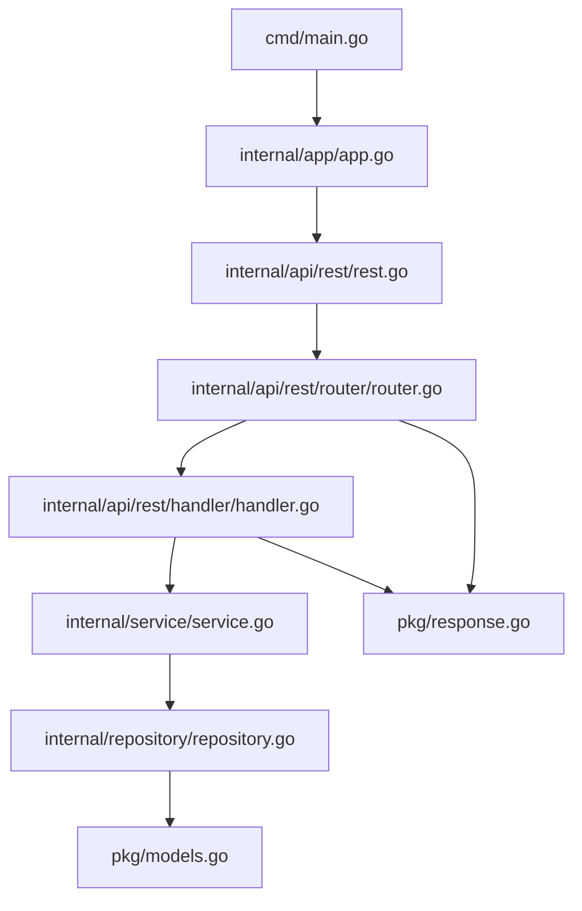

# go-microservice-template

A standard template for building microservices in Go.

---

## Table of Contents

- [Project Structure](#project-structure)
- [Dependency Diagram](#dependency-diagram)
- [Key Features](#key-features)
- [Getting Started](#getting-started)
- [Usage Guidelines](#usage-guidelines)
- [Example: Concurrency Endpoint](#example-concurrency-endpoint)
- [License](#license)

---

## Project Structure

```text
go-microservice-template/
├── cmd/
│   └── main.go                # Entry point of the application
├── internal/
│   ├── api/
│   │   └── rest/
│   │       ├── rest.go        # REST server setup
│   │       ├── handler/
│   │       │   └── handler.go # HTTP handlers
│   │       └── router/
│   │           └── router.go  # Route definitions
│   ├── app/
│   │   └── app.go             # Application lifecycle management
│   ├── repository/
│   │   └── repository.go      # Data access layer
│   └── service/
│       └── service.go         # Business logic layer
├── pkg/
│   ├── models.go              # Shared data models
│   └── response.go            # Common response utilities
├── scripts/                   # Utility scripts (if any)
├── go.mod
├── go.sum
├── LICENSE
└── README.md
```

## Dependency Diagram



## Key Features

- **Layered architecture**: Clean separation between API, service, and repository layers.
- **REST API**: Easily extendable REST server with route and handler organization.
- **Reusable utilities**: Common response helpers and models in `pkg/`.
- **Lifecycle management**: Uses a component manager for clean startup/shutdown.
- **Concurrency Example**: Demonstrates Go's concurrency with a dedicated endpoint.

## Getting Started

1. **Clone the repository:**

   ```sh
   git clone https://github.com/neo7337/go-microservice-template.git
   cd go-microservice-template
   ```

2. **Run the service:**

   ```sh
   go run cmd/main.go
   ```

3. **API Endpoints:**
   - `GET /api/healthz` — Health check
   - `GET /api/users` — List users
   - `GET /api/concurrency-demo` — Demonstrates concurrent processing

---

## Usage Guidelines

Follow these steps to quickly build your own microservice using this template:

1. **Clone the Template**

   ```sh
   git clone https://github.com/neo7337/go-microservice-template.git
   cd go-microservice-template
   ```

2. **Update Module Name**

   Edit `go.mod` and change the module path to your own repository:

   ```go
   module github.com/yourusername/your-microservice
   ```

   Then run:

   ```sh
   go mod tidy
   ```

3. **Define Your Data Models**

   Edit or add new structs in `pkg/models.go` to represent your domain entities.

4. **Implement Business Logic**

   Add or modify service functions in `internal/service/` to handle your business logic.

5. **Set Up Data Access**

   Update or create repository functions in `internal/repository/` to interact with your data sources (e.g., databases, external APIs).

6. **Create API Handlers and Routes**

   - Add new handler functions in `internal/api/rest/handler/` for your endpoints.
   - Register new routes in `internal/api/rest/router/router.go` and link them to your handlers.

7. **Customize Application Startup**

   Modify `internal/app/app.go` if you need to register additional components or change startup behavior.

8. **Run Your Microservice**

   ```sh
   go run cmd/main.go
   ```

   Your service will be available at `http://localhost:8282/api` by default.

9. **Extend and Organize**

   - Add more packages under `internal/` as your service grows.
   - Use the `pkg/` directory for shared utilities and types.
   - Add scripts to the `scripts/` directory for automation or setup tasks.

10. **Testing**

    Add your tests alongside your code or in a dedicated `test/` directory (create if needed).

---

## Example: Concurrency Endpoint

The `/api/concurrency-demo` endpoint demonstrates how to use goroutines and channels to perform concurrent operations and aggregate their results. This is useful for scenarios like fetching data from multiple sources in parallel.

**Sample response:**

```json
{
  "users": [
    {"id":1,"name":"John Doe","age":30,"email":"john.doe@mail.com"},
    {"id":2,"name":"Jane Smith","age":25,"email":"jane.smith@mail.com"}
  ],
  "info": {"message": "Hello from goroutine!"}
}
```

---

By following these steps, you can quickly scaffold and build robust Go microservices using this template.

## License

This project is licensed under the MIT License.
